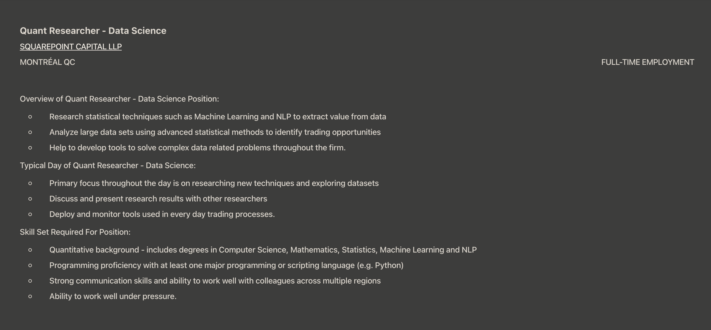
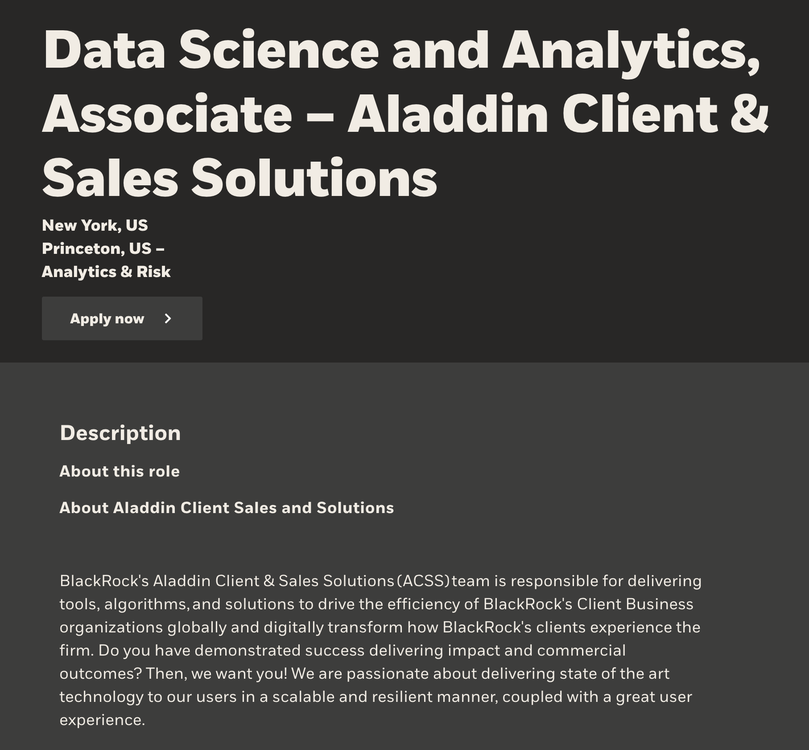
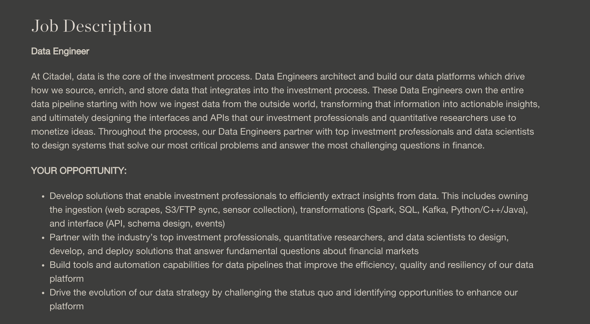

# Task 1: Data Science Careers

The links to the job postings:

- [SquarePoint Capital](https://www.eluta.ca/spl/quant-researcher-data-science-00ece7b8ff8a83fe47ae66a33de5470a)
- [BlackRock](https://careers.blackrock.com/job/13038290/data-science-and-analytics-associate-aladdin-client-sales-solutions-new-york-ny/)
- [Citadel](https://www.citadel.com/careers/details/data-engineer/)

During the pandemic, while in lockdown, I started reading into finance and the stock market and found a passion for financial companies, stocks and how some institutes hedge wealthy individuals and corporations finances to increase their returns. My passion for Software Engineering and Finance lead me to want to combine these two to work as a data scientist or data engineer at a hedgefund.

# Task 2: Highs and Lows

- What were the highlights of the class for you?
  - I enjoyed learning about EC2 and a little more about how AWS worked. This was the part that I really wanted to learn from the class.
- What could have been done better? How?
  - Some of the classes could have been delivered faster. The time could have been spent learning different things.
  - Weekly assigmnents are perfect for staying in the loop of the class and not allowing students to fall behind. But that also doesn't allow us to have very in-depth assignments. It felt more like an introduction to the concept than learning it. Which, if this was the goal, was done perfectly.
- How did this course impact the future you see for yourself (if at all)?
  - I've enjoyed the course a lot. But I really don't believe or know if it reflected industry work as a data scientist. So, I think I would need to take maybe a more in-depth course before deciding changing my career for data science.
- A couple of you have shared how this helped you in job interviews or land internships. I’d LOVE
to hear these anecdotes if you’re willing to share.
  - No longer interviewing :')

Thank you for the course!
